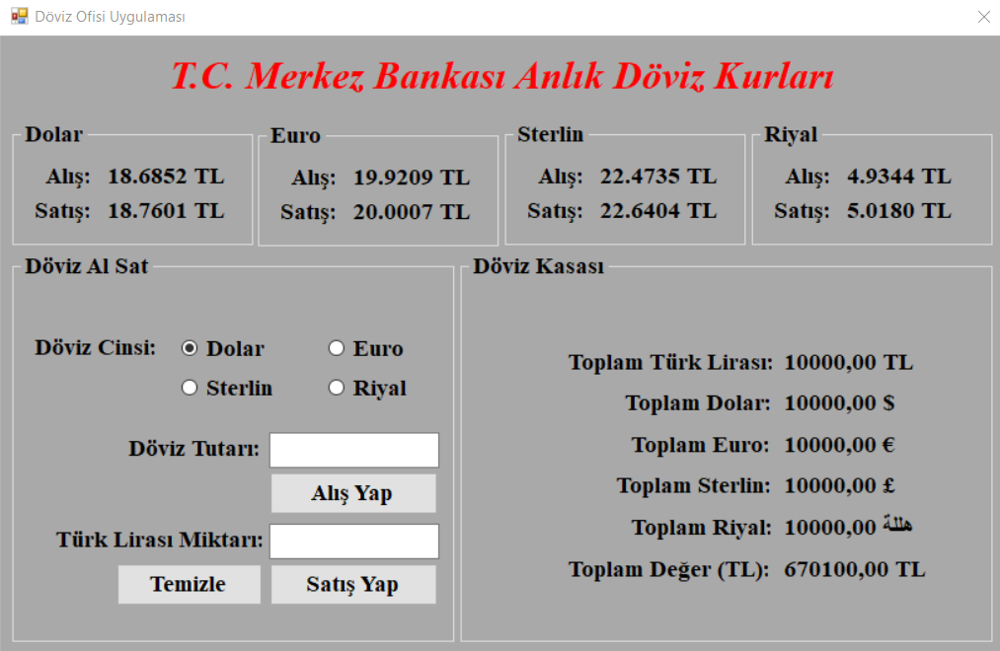
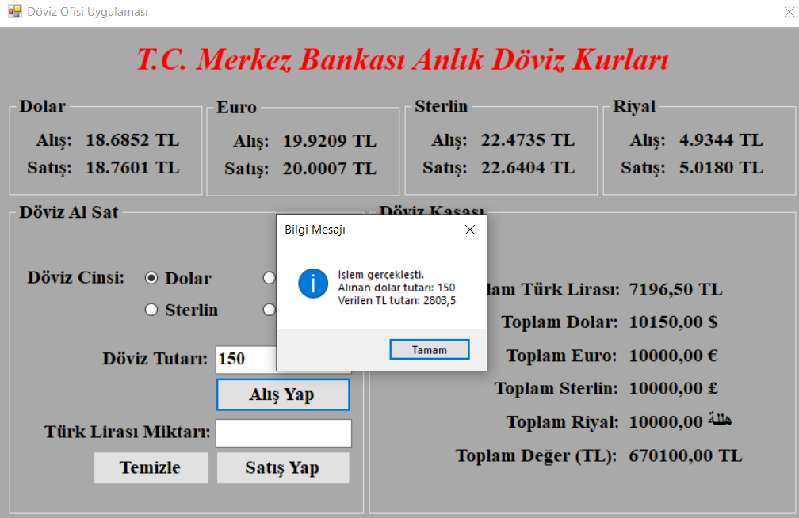
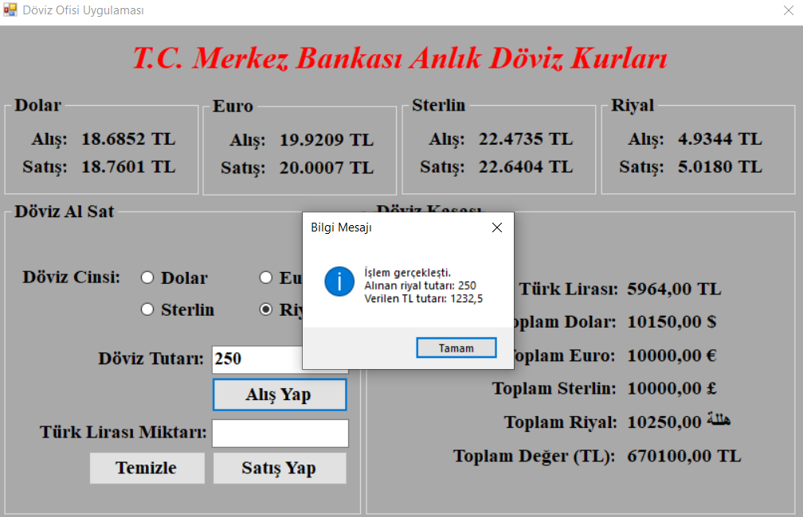
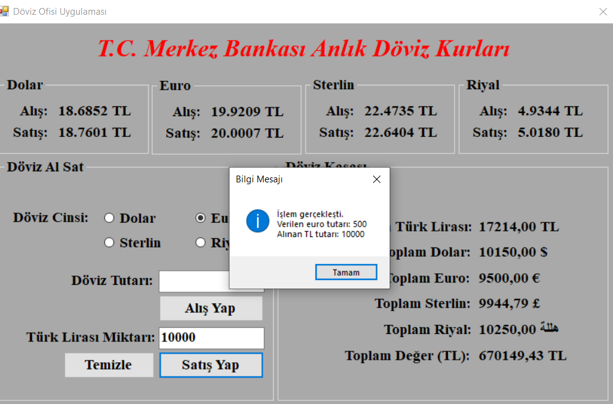
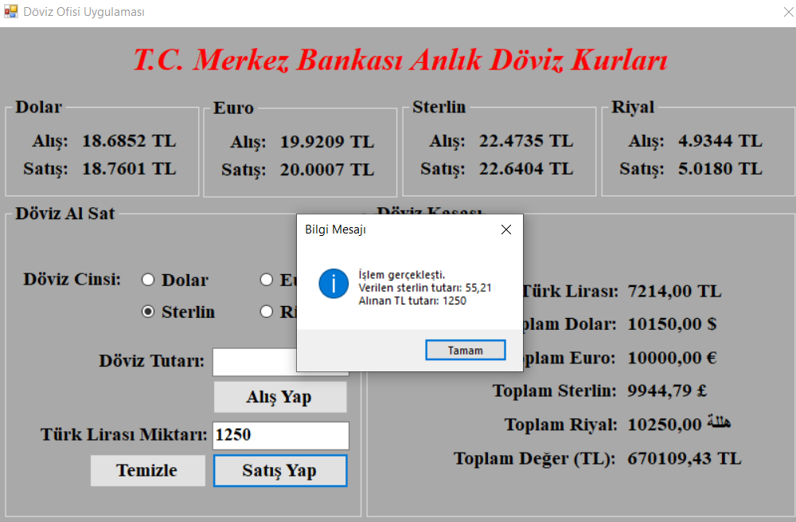
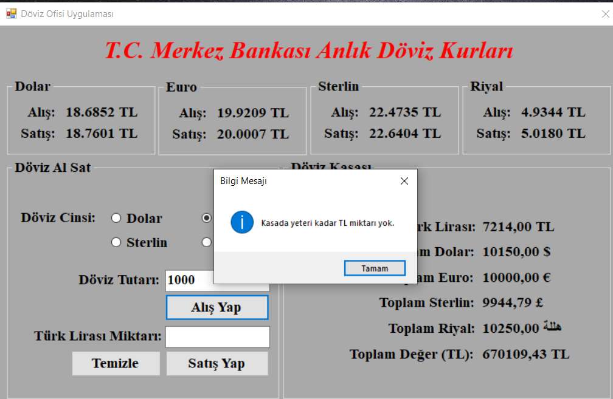
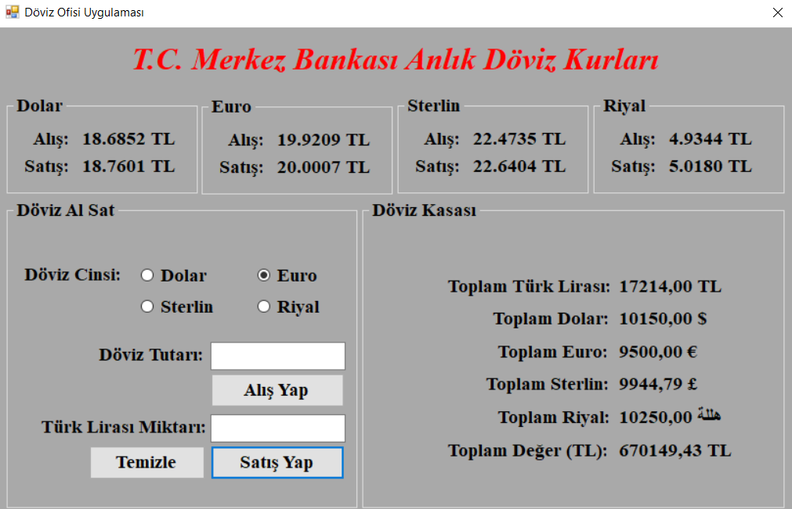

# 01_DovizOfisiUygulamasi Projesi

* Bu projemizde basit bir şekilde XML dosya işlemlerini kullanarak basit bir döviz alım - satım uygulamasını Windows Forms App (.NET Framework) ile gerçekleştirdim.

* Yapacağımız işlemler dört farklı dövizi alım ve satımını uygun durumlarda gerçekleştirmek ve toplam kasadaki paraları doğru bir şekilde hesaplamaktır. Şimdi beraber uygulamamızı inceleyelim.

## Aşağıdaki resimde projemizin açılış durumu gösterilmektedir.

## Müşteri tarafından dolar bozdurma işlemi sonrası gelen uyarı ve kasada değişen durum gösterilmektedir.

## Müşteri tarafından riyal bozdurma işlemi sonrası gelen uyarı ve kasada değişen durum gösterilmektedir.

## Müşteri tarafından euro alma işlemi sonrası gelen uyarı ve kasada değişen durum gösterilmektedir.

## Müşteri tarafından sterlin alma işlemi sonrası gelen uyarı ve kasada değişen durum gösterilmektedir.

## Eğer herhangi bir yapılacak işlemlerde kasada yeterli bir tutar yok ise bir uyarı veren mesaj sistemi gösterilmektedir.

## Yapılan işlemler sonrası son durum

## XML Dosya İşlemlerini Nasıl Kullandım Adım Adım Anlatalım.

* İlk olarak XML dosyasındaki bilgileri kullanabilmek ve işlem yapabilmek için aşağıdaki kütüphaneyi kullanmamız gereklidir.

~~~ C#
using System.Xml;
~~~

* Daha sonra döviz kurlarını merkez bankasından alacağımız için gerekli olan XML dosyasının bağlantı yolunu string formatta global alanda tanımladım. Herhangi bir değişiklik olduğunda uygulamayı kullanırken bile değişmeyi gösterecek.

~~~ C#
string yol = "https://www.tcmb.gov.tr/kurlar/today.xml";
~~~

* Daha sonra kurları getiren işlemlerden doların alım ve satım kurlarını getiren işlemine bakalım. 

* Burada ilk olarak yeni bir xml dosyası oluşturduk ve içerisine bağlantı adresimizdeki bilgileri kaydettik. Sonra içerisindeki **Currency** içerisindek kodu **USD** olan BanknoteBuying ve BanknoteSelling ayrı ayrı string formatta kaydedildi. Aynı işlem euro, sterlin ve riyal için yapılabilir. Sadece kodları farklı olacak. Euro için **EUR**, sterlin için **GBP** ve riyal için **SAR** kullandığımızda veriler gelecektir.

* Burada aklınıza şu soru gelmiş olabilir. "Parasal değerleri decimal veri tipinde değil de neden string formatta tuttuk?" diye. Bunun cevabı ise XML dosyamızda girilen ifade string formattadır. O nedenle string formatta tuttuk. Eğer decimal veri tipinde tutacaksanız **Convert** işlemi yapmak zorundasınız.

~~~ C#
var xmlDosya = new XmlDocument();
xmlDosya.Load(yol);
string dolarAlis = xmlDosya.SelectSingleNode("Tarih_Date/Currency[@Kod='USD']/BanknoteBuying").InnerXml;
string dolarSatis = xmlDosya.SelectSingleNode("Tarih_Date/Currency[@Kod='USD']/BanknoteSelling").InnerXml;
~~~

* Döviz alım satımlarda çok fazla ondalıklı ifadeye girmemek için virgülden sonraki ilk 2. basamağa göre yuvarlama işlemi yapılarak hesaplamalar yapılır. Aşağıda yuvarlama işleminde örnek verilmiştir.

~~~ C#
Math.Round(dolar, 2);
~~~
