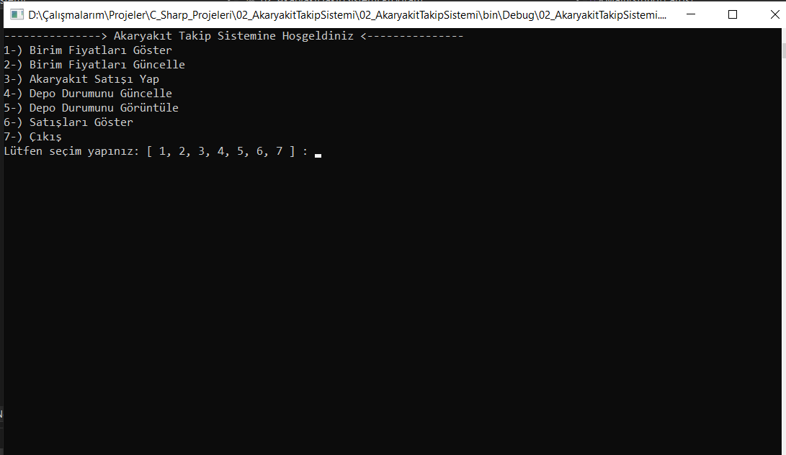
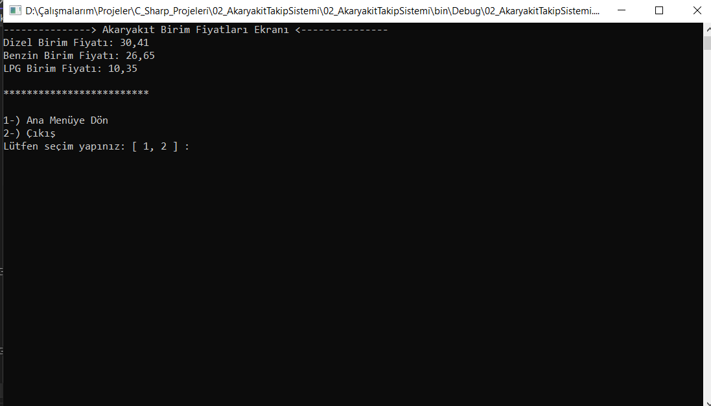
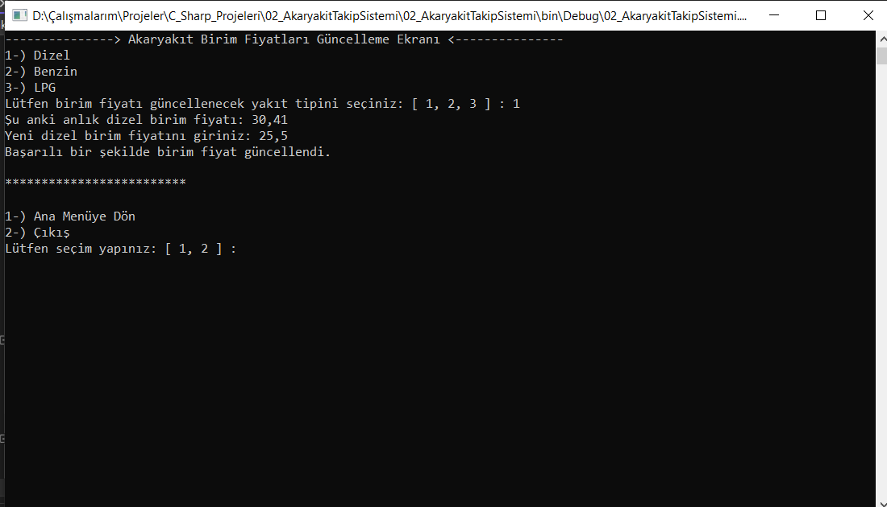
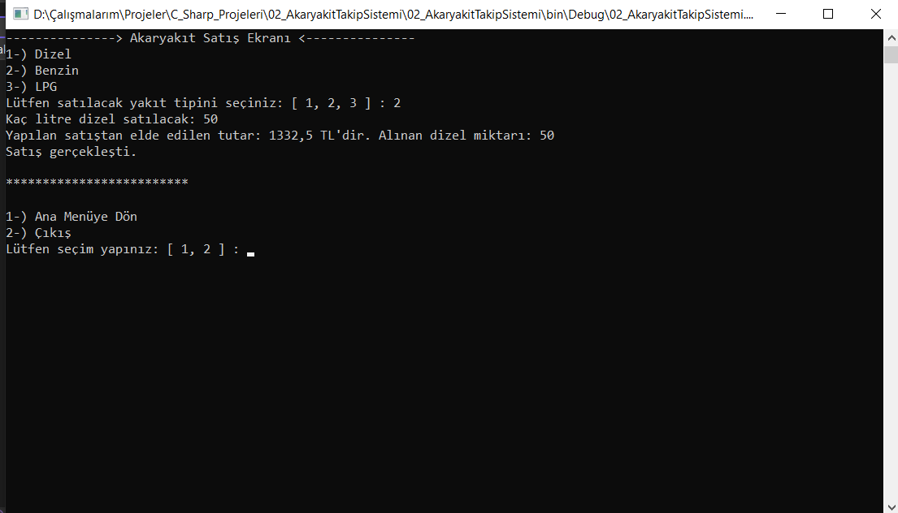
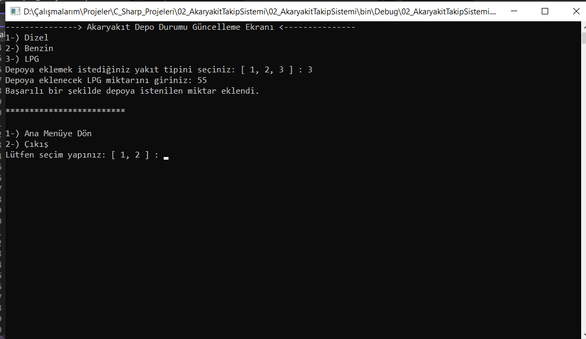
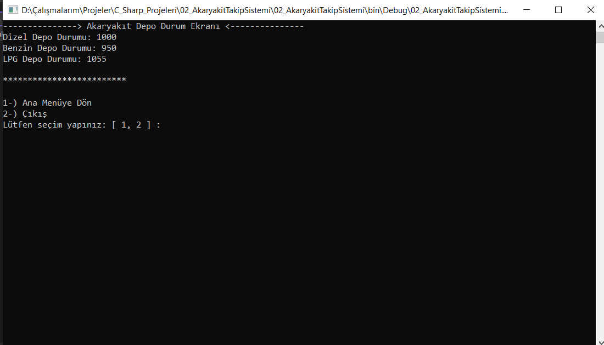
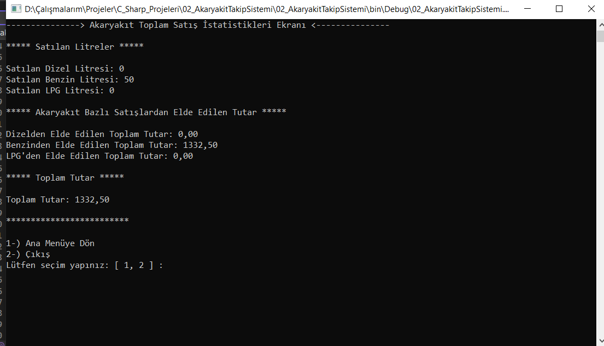

# 02_AkaryakitTakipSistemi Projesi

* Bu projemde basit bir şekilde bir akaryakıt istasyonundaki işlemlerimizin kontrolünü Console App (.NET Framework) projesi ile gerçekleştirdim. 

* Yapacağımız işlemleri göstermeden önce ilk olarak kabaca bir anlatalım. Numara sırasına göre console ekranlarını anlatalım.

## Aşağıdaki resimde akaryakıt takip sisteminin ana menüsünün bir görüntüsünü görüyorsunuz.

## 1. Akaryakıt birim fiyatlarını gösteren ekran bölümüdür.

## 2. Akaryakıt birim fiyatlarını güncelleyen (zam veya indirim) ekran bölümüdür.

## 3. Akaryakıt satış işlemleri ekranıdır.

## 4. Akaryakıt depolarını güncelleyen (depolara ekleme) ekrandır.

## 5. Akaryakıt depolarında kalan miktarı gösteren ekran bölümüdür.

## 6. Toplam yapılan satış istatistiklerini gösteren ekran bölümüdür.

## Hata Kontrolleri

* İlk olarak bu akaryakıt takip sistemine kullanan kullanıcının yapacağı hataları kontrol edebilmek için birkaç hata metodu oluşturdum. Onları inceleyerek başlayalım.

* Buradaki hata kontrolüm sistemimizde bir akaryakıt satışında girilecek litrenin tam sayı cinsinden olması ve pozitif olmasını bekliyoruz. Eğer kullanıcı bunun dışında aksi bir veri girmeye çalışırsa durumu kontrol altına alırız.

~~~ C#
private static bool PozitifTamSayiMi(string veri)
{
    try
    {
        int sayi = Convert.ToInt32(veri);
        if (sayi > 0)
        {
            return true;
        }
        else
        {
            return false;
        }
    }
    catch (Exception)
    {
        return false;
    }
}
~~~

* Buradaki hata kontrolümüz ise kullanıcı akaryakıt birim fiyatlarını güncellemek isterse pozitif ve ondalıklı sayı girmesi beklenir ama kullanıcı aksi bir veri girmesi durumunda oluşacak hataları kontrol altına alırız bu metodumuzla.

~~~ C#
private static bool PozitifSayiMi(string veri)
{
    try
    {
        double sayi = Convert.ToDouble(veri);
        if (sayi > 0)
        {
            return true;
        }
        else
        {
            return false;
        }
    }
    catch (Exception)
    {
        return false;
    }
}
~~~

* Ana menümüzde 7 farklı seçim olabileceğinden ve bu seçimleri kullanıcı 1, 2, 3, 4, 5, 6 ve 7 rakamları ile yapacağından dolayı bir hata kontrol metodu oluşturdum. Yanlış girilmeler durumunda hata rahat bir şekilde kontrol altına alınabilsin diye.

~~~ C#
 private static bool AnaMenuSecimKontrol(string veri)
{
    try
    {
        int sayi = Convert.ToInt32(veri);
        if (sayi >= 1 && sayi <= 7)
        {
            return true;
        }
        else
        {
            return false;
        }
    }
    catch (Exception)
    {
        return false;
    }
}
~~~

* Ana menüden sonra seçim yapılan ekranlardan geçiş yapabilmek için 2 farklı seçenek vardır. Bu seçenekler ise 1 ve 2 rakamlarından oluşuyor. O nedenle 1 ve 2 dışında girilen bir veri de hata kontrolü yapılmalıdır.

~~~ C#
private static bool YanMenuSecimKontrol(string veri)
{
    try
    {
        int sayi = Convert.ToInt32(veri);
        if (sayi >= 1 && sayi <= 2)
        {
            return true;
        }
        else
        {
            return false;
        }
    }
    catch (Exception)
    {
        return false;
    }
}
~~~

* Kullanıcımız akaryakıt seçimlerini 1, 2 ve 3 rakamları ile yapacaktır. Biz de kullanıcının bunların dışındaki bir veri girişinde hata kontrolü sağlayabilmemiz için bir metot oluşturdum.

~~~ C#
private static bool YakitTipiSecimi(string veri)
{
    try
    {
        int sayi = Convert.ToInt32(veri);
        if (sayi >= 1 && sayi <= 3)
        {
            return true;
        }
        else
        {
            return false;
        }
    }
    catch (Exception)
    {
        return false;
    }
}
~~~